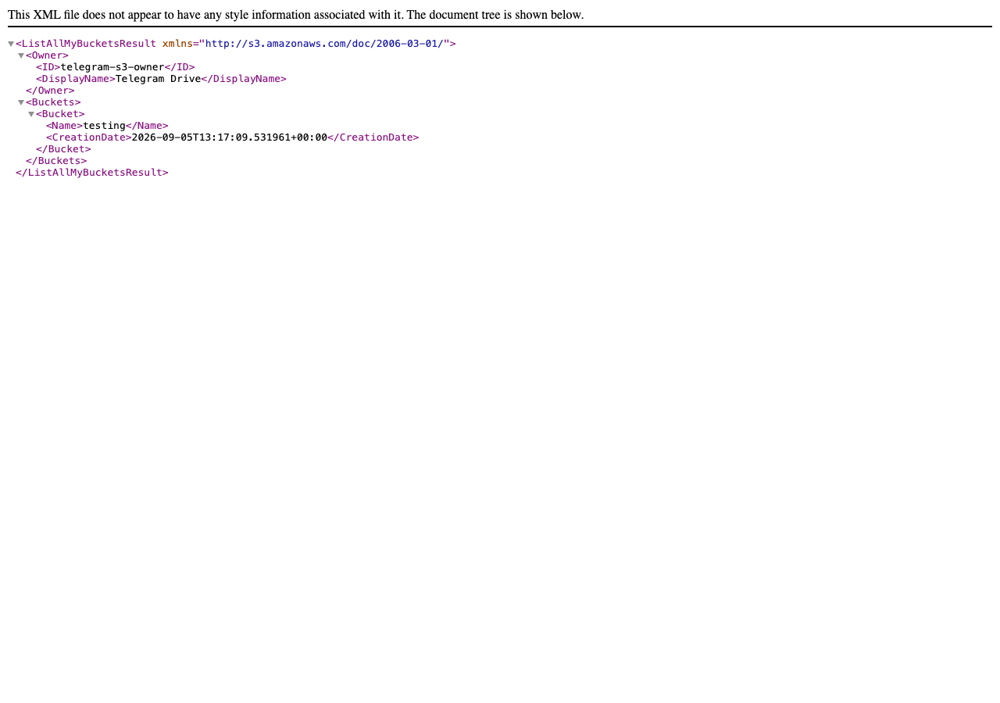
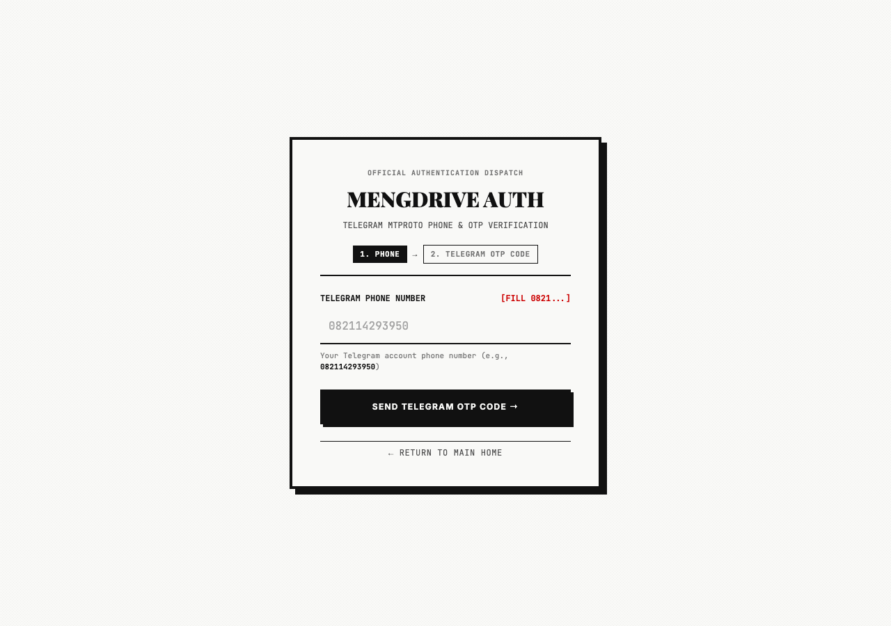
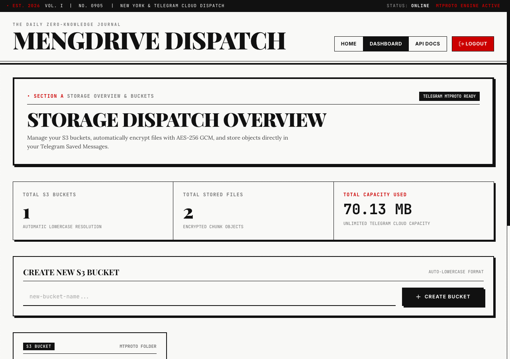
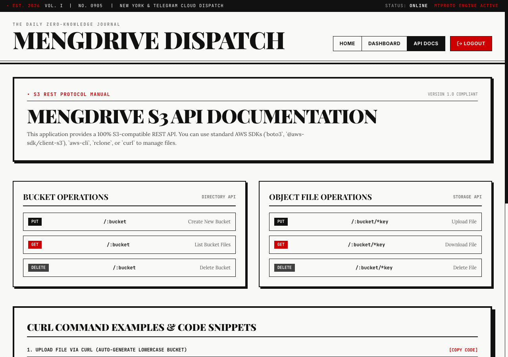

# 🌿 MengDrive - Telegram S3 Object Storage Engine

**MengDrive** is a high-performance, S3-compatible Object Storage Engine built with Rust. It leverages the **Telegram MTProto Engine** for unlimited cloud storage and **Turso / libSQL Database** for ultra-fast metadata indexing.

All uploaded files are automatically chunked into 45MB parts and stored **unencrypted** directly in your Telegram Saved Messages (`me`) — enabling instant seekable streaming like a native Telegram drive. (Legacy uploads encrypted with AES-256-GCM remain readable.)

---

## 📸 Interface Screenshots

### 1. Landing Page (`/`)


### 2. Telegram Authentication & OTP Verification (`/login`)


### 3. Storage Overview & Bucket Management (`/ui`)


### 4. S3 REST API Manual (`/ui/docs`)


---

## ⚡ Key Features

- **100% S3 API Compatibility**: Native REST endpoints (`PUT`, `GET`, `DELETE`, `HEAD`) compatible with `aws-cli`, `rclone`, Cyberduck, or any S3 SDK (`boto3`, `@aws-sdk/client-s3`).
- **Telegram MTProto Storage**: Blazing fast upload & download speeds using Telegram's MTProto user socket client (`grammers`).
- **True Streaming (No Decrypt Wait)**: Objects are stored **unencrypted** in 45MB chunks, so downloads and video/audio streaming are served directly from Telegram with lazy partial reads (`upload.GetFile` offsets) — no full download + decrypt roundtrip. HTTP 206 Range requests are answered instantly.
- **Bounded-Memory Uploads**: Incoming uploads stream chunk-by-chunk straight to Telegram; files are never fully buffered in RAM.
- **Legacy AES-256 GCM Support**: Old objects encrypted with AES-256-GCM (nonce recorded per chunk) are still transparently decrypted on read.
- **Saved Messages Target**: Direct storage into Telegram's personal Saved Messages peer (`me`) with unlimited capacity.
- **Auto-Bucket Formatting**: Buckets are dynamically resolved and names auto-converted to lowercase.
- **HTTP 206 Partial Streaming**: Instant video and audio streaming without loading the entire payload into memory.
- **Newsprint Editorial Design**: High-contrast, typographic aesthetic with Playfair, Lora, Inter, and JetBrains Mono fonts.

---

## 🔑 How to Get Credentials

To run MengDrive, you need credentials for **Telegram API**, **Turso DB**, and a **Master Encryption Key**.

### 1. Telegram API Credentials (`my.telegram.org`)
1. Go to Telegram's official portal: [https://my.telegram.org](https://my.telegram.org).
2. Log in with your Telegram account phone number (international format, e.g., `+6282114293950`).
3. Enter the confirmation code sent to your Telegram app.
4. Select **API Development Tools**.
5. Fill in the App Title and Short Name (e.g. `MengDrive`).
6. Copy your credentials:
   - **`TELEGRAM_API_ID`**: Numeric ID (e.g., `38087779`)
   - **`TELEGRAM_API_HASH`**: 32-character hex string (e.g., `4381f420c5c020a610c2e95ad82c913c`)

---

### 2. Turso DB Credentials (Cloud or Local SQLite)

#### Option A: Turso Cloud (Recommended)
1. Install Turso CLI:
   ```bash
   curl -sSfL https://get.tur.so | sh
   ```
2. Log in or create an account:
   ```bash
   turso auth login
   ```
3. Create a new database:
   ```bash
   turso db create object-storage
   ```
4. Obtain database URL & token:
   ```bash
   turso db show object-storage --url
   turso db tokens create object-storage
   ```

#### Option B: Local SQLite (Offline Mode)
For offline local development, set:
```env
TURSO_DATABASE_URL=file:local.db
TURSO_AUTH_TOKEN=
```

---

### 3. Master Encryption Key
Generate a secure 32-byte (64-character hex) key for AES-256 encryption:
```bash
openssl rand -hex 32
```

---

## 🐳 Docker & Release

The Docker image ships **only the prebuilt release binary + templates** — no Rust toolchain, no source code, no compilation inside the image.

```bash
# One-time: activate the pre-push build gate (check → test → release build → docker build)
./scripts/setup-hooks.sh

# Local release build (this artifact is what goes into the image)
make build

# Build image from the prebuilt binary
make docker-build          # -> simenglabs/teledrive:latest

# Push to Docker Hub (docker login required)
make docker-push

# Or all at once
make release
```

`git push` automatically runs the full pipeline via the pre-push hook:
`cargo check` → `cargo test` → `cargo build --release` → `docker build`.
Skip with `git push --no-verify`.

### Run with Docker Compose

```bash
cp .env.example .env   # fill in TELEGRAM_API_ID / TELEGRAM_API_HASH
docker compose up -d
# Dashboard: http://localhost:3060/ui
```

---

## 🚀 Quick Start Guide

### 1. Configuration Setup

Copy `.env.example` to `.env` and insert your credentials:

```bash
cp .env.example .env
```

Edit your `.env`:
```env
TELEGRAM_API_ID=38087779
TELEGRAM_API_HASH=4381f420c5c020a610c2e95ad82c913c
TURSO_DATABASE_URL=file:local.db
TURSO_AUTH_TOKEN=
MASTER_ENCRYPTION_KEY=000102030405060708090a0b0c0d0e0f101112131415161718191a1b1c1d1e1f
SERVER_PORT=3060
```

### 2. Run Application
```bash
cargo run
```

Access the Web Portal:
- **Landing Page**: [http://localhost:3060/](http://localhost:3060/)
- **Telegram OTP Sign-In**: [http://localhost:3060/login](http://localhost:3060/login)
- **Storage Dashboard**: [http://localhost:3060/ui](http://localhost:3060/ui)
- **S3 API Manual**: [http://localhost:3060/ui/docs](http://localhost:3060/ui/docs)

---

## 📡 S3 REST API Usage

### Upload File (Auto-creates Lowercase Bucket)
```bash
curl -X PUT http://localhost:3060/my-bucket/sample.png \
  -H "Content-Type: image/png" \
  --data-binary "@sample.png"
```

### Download File
```bash
curl -o downloaded.png http://localhost:3060/my-bucket/sample.png
```

### List Bucket Objects
```bash
curl http://localhost:3060/my-bucket
```

### Delete Object
```bash
curl -X DELETE http://localhost:3060/my-bucket/sample.png
```

---

## 📜 License

Distributed under the [MIT License](LICENSE). Built with ❤️ by MengLabs.
